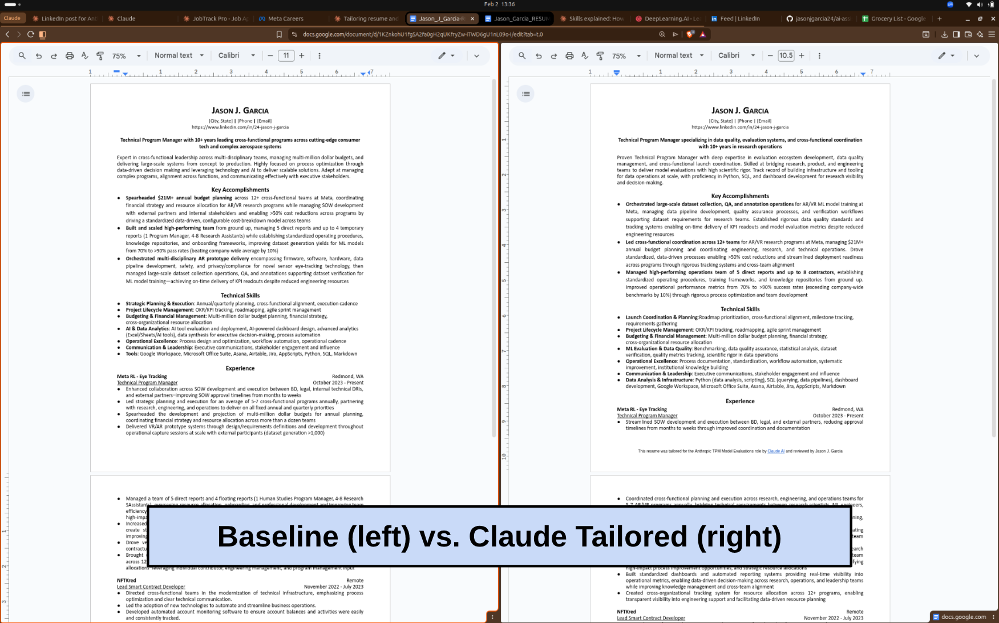

# AI-Assisted Job Search

A Claude AI skill for automating and optimizing job application materials using LinkedIn Parsing System (LPS) and Applicant Tracking System (ATS) best practices.

## Overview

This repository contains the **job-application-helper** skill, a comprehensive Claude Code skill that tailors resumes and cover letters for specific job postings. The skill specializes in Technical Program Manager, Senior Integration Engineer, and Engineering Program Manager roles in Tech, Aerospace/Defense, and Outdoors industries.

### Example Resume Output


### Key Features

- **LPS/ATS Optimization**: Ensures resumes pass automated screening systems with targeted keyword density (60-80% match)
- **XML-Based Resume Editing**: Preserves exact formatting by directly editing .docx XML structure
- **Cover Letter Generation**: Creates compelling, company-specific cover letters with web-researched content
- **Quality Assurance**: Automated page count verification and formatting validation
- **Multi-Step Workflow**: Guided process from job description analysis to final document delivery

## Table of Contents

- [⚠️ Important: Personalization Required](#️-important-personalization-required)
  - [Files You MUST Update](#files-you-must-update)
  - [Quick Start Checklist](#quick-start-checklist)
- [How the Job Application Helper Works](#how-the-job-application-helper-works)
  - [Step 1: Job Description Analysis](#step-1-job-description-analysis)
  - [Step 2: Resume Tailoring](#step-2-resume-tailoring)
  - [Step 3: Cover Letter Creation](#step-3-cover-letter-creation)
  - [Step 4: Quality Assurance](#step-4-quality-assurance)
  - [Step 5: Delivery](#step-5-delivery)
- [Repository Structure](#repository-structure)
- [Using the Skill](#using-the-skill)
  - [With Claude Code (CLI)](#with-claude-code-cli)
  - [With Claude AI (Browser)](#with-claude-ai-browser)
- [Advanced Customization](#advanced-customization)
- [Additional Capabilities](#additional-capabilities)
- [Technical Details](#technical-details)
  - [LPS/ATS Optimization Strategy](#lpsats-optimization-strategy)
  - [XML Editing Approach](#xml-editing-approach)
- [Dependencies](#dependencies)
- [License](#license)
- [Contributing](#contributing)
- [Acknowledgments](#acknowledgments)

## ⚠️ Important: Personalization Required

**This skill is pre-configured with example data and MUST be customized before use.** The asset files and reference data are specific to the original user and will not work for your job search without modification.

### Files You MUST Update

#### 1. Asset Files (Your Documents)

**Location**: `job-application-helper/assets/`

- **`Jason_J_Garcia-RESUME.docx`**: Replace with your own baseline resume
  - Use placeholder text like `[City, State]`, `[Phone]`, `[Email]`, `[LinkedIn]` for contact info
  - Maintain standard section headers (Experience, Education, Technical Skills, Key Accomplishments)
  - Use consistent formatting (the XML editing approach depends on it)
  - Ensure it's a `.docx` file, not `.doc` or PDF

- **`Jason_J_Garcia-COVERLETTER.md`**: Replace with your own cover letter template
  - Keep the placeholder structure for dynamic content
  - Match your preferred writing style and tone

#### 2. Reference Files (Your Background)

**Location**: `job-application-helper/references/`

- **`user_profile.md`**: Update with YOUR information
  - Current role, experience level, location
  - Target roles, industries, salary range
  - Key competencies and career goals
  - Work preferences (remote, hybrid, onsite)

- **`list_of_key_accomplishments.md`**: Replace with YOUR achievements
  - Use metrics and specific outcomes
  - Format: bold opening + detailed description
  - Include 5-10 accomplishments to choose from

- **`list_of_target_companies.md`**: Replace with YOUR target companies
  - Companies you're actively pursuing
  - Used for networking and research prioritization

#### 3. Skill Configuration (Hard-Coded Dependencies)

**Location**: `job-application-helper/SKILL.md`

The SKILL.md file contains hard-coded references that must be updated:

**Line 12**: LinkedIn Profile URL
```yaml
- **LinkedIn Profile**: https://www.linkedin.com/in/24-jason-j-garcia/
```
→ Change to your LinkedIn profile URL

**Line 10-11**: Baseline resume filename
```yaml
- **Baseline Resume**: `assets/Jason_J_Garcia-RESUME.docx`
- **Cover Letter Template**: `assets/Jason_J_Garcia-COVERLETTER.md`
```
→ Update to match your renamed asset files (or keep the same filenames)

**Line 196-197**: Output filename pattern
```yaml
- Resume filename: `Jason_Garcia_RESUME-[CompanyName]-[RoleTitle].docx`
- Cover letter filename: `Jason_Garcia_COVERLETTER-[CompanyName]-[RoleTitle].docx`
```
→ Update to use your name

**Line 6**: Skill description
```yaml
description: "... This skill specializes in Technical Program Manager, Senior Integration Engineer, and Engineering Program Manager roles in Tech, Aerospace/Defense, and Outdoors industries..."
```
→ Update to reflect your target roles and industries

### Quick Start Checklist

Before using this skill for the first time:

- [ ] Replace `assets/Jason_J_Garcia-RESUME.docx` with your baseline resume
- [ ] Replace `assets/Jason_J_Garcia-COVERLETTER.md` with your cover letter template
- [ ] Update `references/user_profile.md` with your background and goals
- [ ] Update `references/list_of_key_accomplishments.md` with your achievements
- [ ] Update `references/list_of_target_companies.md` with your target companies
- [ ] Edit `SKILL.md` line 12 to include your LinkedIn URL
- [ ] Edit `SKILL.md` lines 196-197 to use your name in output filenames
- [ ] (Optional) Edit `SKILL.md` line 6 to reflect your target roles/industries

## How the Job Application Helper Works

The skill follows a structured 5-step workflow:

### Step 1: Job Description Analysis

When you provide a job posting URL or text, the skill:
- Extracts must-have vs. preferred qualifications
- Identifies keyword clusters (technical skills, tools, domain expertise, soft skills)
- Maps job requirements to your experience
- Highlights skill gaps and unique differentiators

### Step 2: Resume Tailoring

**Critical Feature: XML-Based Editing**

Unlike tools that recreate documents (causing formatting issues), this skill uses direct XML manipulation to preserve exact Microsoft Word formatting:

```bash
# 1. Copy and unpack baseline resume to XML
bash scripts/prepare_resume.sh [output_filename].docx

# 2. Edit XML directly (document.xml)
# 3. Pack edited XML back to .docx
python3 /path/to/pack.py unpacked/ [output_filename].docx --original baseline_resume.docx
```

The skill modifies:
- **Branding Headline**: Role-specific positioning statement
- **Summary**: 3-4 sentences with top keywords from job description
- **Key Accomplishments**: Reordered by relevance, keyword-optimized
- **Technical Skills**: Reordered categories to match job priorities
- **Experience**: Bullets reordered and rewritten with parallel language from job posting

**Page Limit**: Maintains strict 2-page maximum through strategic content reduction.

### Step 3: Cover Letter Creation

Generates tailored cover letters with:
- Company research via web search (recent news, products, initiatives)
- STAR method accomplishments matching top requirements
- Cultural fit demonstration
- Specific metrics and outcomes

### Step 4: Quality Assurance

Automated verification:
- Page count validation (must be exactly 2 pages)
- Keyword density check (60-80% target)
- ATS compatibility verification
- Formatting consistency

### Step 5: Delivery

Files are delivered with standardized naming:
- `Jason_Garcia_RESUME-[CompanyName]-[RoleTitle].docx`
- `Jason_Garcia_COVERLETTER-[CompanyName]-[RoleTitle].docx`

## Repository Structure

```
ai-assisted-job-search/
├── job-application-helper/          # Main skill folder
│   ├── SKILL.md                      # Skill definition and workflow
│   ├── assets/                       # Baseline documents
│   │   ├── Jason_J_Garcia-RESUME.docx
│   │   └── Jason_J_Garcia-COVERLETTER.md
│   ├── references/                   # Knowledge base
│   │   ├── user_profile.md           # Target roles, competencies, goals
│   │   ├── xml_editing_guide.md      # XML formatting rules
│   │   ├── list_of_key_accomplishments.md
│   │   ├── list_of_target_companies.md
│   │   ├── qa_and_delivery.md
│   │   ├── company_research.md
│   │   ├── interview_preparation.md
│   │   ├── skill_gap_analysis.md
│   │   └── networking_support.md
│   └── scripts/                      # Automation scripts
│       ├── prepare_resume.sh
│       └── verify_page_count.sh
└── utils/                            # Packaging utilities
    ├── package_skill.py              # Creates .skill file
    ├── quick_validate.py             # Validates skill structure
    └── customized-prompt-template.md
```

## Using the Skill

### With Claude Code (CLI)

If you have Claude Code installed:

1. Copy the skill folder to your skills directory:
   ```bash
   cp -r job-application-helper ~/.claude/skills/
   ```

2. Use the skill in conversation:
   ```
   /job-application-helper

   I'm applying to [Company] for [Role]. Here's the job description:
   [paste job description]
   ```

### With Claude AI (Browser)

To use this skill with Claude.ai through your browser, you need to package it into a `.skill` file:

#### Prerequisites

- Python 3.x installed
- `zipfile` module (included in standard Python)

#### Packaging Instructions

1. **Navigate to the repository root**:
   ```bash
   cd /path/to/ai-assisted-job-search
   ```

2. **Run the packaging script**:
   ```bash
   python utils/package_skill.py job-application-helper
   ```

   This will:
   - Validate the skill structure (check for SKILL.md, proper formatting)
   - Create a `job-application-helper.skill` file in the current directory
   - Display all files being packaged

   Optional: Specify an output directory:
   ```bash
   python utils/package_skill.py job-application-helper ./dist
   ```

3. **Upload to Claude.ai**:
   - Go to [claude.ai](https://claude.ai)
   - Open Settings → Capabilities → Skills
   - Click "+ Add"
   - Click "Upload a skill"
   - Select the local `job-application-helper.skill` file
   - The skill will appear in your skills library

4. **Use the skill**:
   - Start a new conversation or use an existing one
   - Type `/job-application-helper` to activate the skill
   - Paste a job description and let Claude tailor your application materials

#### What package_skill.py Does

The packaging script (`utils/package_skill.py`):

1. **Validates** the skill folder:
   - Checks for required `SKILL.md` file
   - Validates YAML frontmatter (name, description)
   - Ensures skill folder structure is correct

2. **Creates a .skill file**:
   - Bundles the entire skill folder into a zip archive
   - Preserves folder structure and all file paths
   - Uses `.skill` extension (recognized by Claude.ai)

3. **Provides feedback**:
   - Shows validation results
   - Lists all files being packaged
   - Confirms successful creation with output path

Example output:
```
📦 Packaging skill: job-application-helper

🔍 Validating skill...
✅ Skill validation passed

  Added: job-application-helper/SKILL.md
  Added: job-application-helper/assets/Jason_J_Garcia-RESUME.docx
  Added: job-application-helper/assets/Jason_J_Garcia-COVERLETTER.md
  [... more files ...]

✅ Successfully packaged skill to: job-application-helper.skill
```

#### Troubleshooting

If packaging fails:

- **Missing SKILL.md**: Ensure `SKILL.md` exists in the skill root folder
- **Invalid YAML**: Check that SKILL.md has valid frontmatter with `name` and `description`
- **Permission errors**: Ensure you have write permissions in the output directory

## Advanced Customization

Beyond the required personalization (see above), you can further customize the skill's behavior:

### Workflow Modifications

1. **Add custom reference files**:
   - Create additional `.md` files in `references/` for domain-specific knowledge
   - Reference them in `SKILL.md` workflow steps
   - Examples: `technical_certifications.md`, `portfolio_projects.md`, `publications.md`

2. **Modify keyword density targets**:
   - Edit `SKILL.md` line 146 to adjust the 60-80% keyword match threshold
   - Lower for more natural language, higher for aggressive ATS optimization

3. **Customize section ordering**:
   - Edit `references/xml_editing_guide.md` to define new section patterns
   - Adjust resume structure based on your industry norms (e.g., Education before Experience for academia)

4. **Add industry-specific templates**:
   - Create alternate baseline resumes for different industries
   - Add conditional logic in `SKILL.md` to select templates based on job posting

### Script Customization

1. **Extend `prepare_resume.sh`**:
   - Add pre-processing steps (e.g., automated backups, version tracking)
   - Integrate with version control for resume iterations

2. **Enhance `verify_page_count.sh`**:
   - Add word count validation
   - Check for common formatting issues
   - Validate keyword density automatically

3. **Create additional utilities**:
   - Job description parser (extract keywords automatically)
   - Cover letter A/B testing tracker
   - Application tracking integration

## Additional Capabilities

Beyond resume and cover letter tailoring, the skill provides:

- **Company Research**: Web search integration for recent company news, products, and initiatives
- **Interview Preparation**: STAR method response crafting, format-specific prep (phone, video, onsite)
- **Skill Gap Analysis**: Compare your qualifications against job requirements
- **Networking Support**: LinkedIn outreach templates, cold email strategies

See the respective files in `references/` for detailed guidance.

## Technical Details

### LPS/ATS Optimization Strategy

Modern hiring systems use two filtering stages:

1. **LinkedIn Parsing System (LPS)**: Screens resumes for keyword density, role-specific language, and structural alignment before human review
2. **Applicant Tracking System (ATS)**: Parses resume content into database fields using section headers and formatting cues

This skill optimizes for both by:
- Placing highest-priority keywords in the first third (branding, summary, accomplishments)
- Using exact phrases from job postings when accurate
- Maintaining parseable structure (no tables, text boxes, or multi-column layouts)
- Using standard section headers
- Quantifying all achievements with specific metrics

### XML Editing Approach

Direct XML editing preserves:
- Exact spacing and indentation
- Font sizes and styles
- Bullet point formatting
- Tab stops and alignment
- Page break positions

The `references/xml_editing_guide.md` contains comprehensive formatting rules, protected XML attributes, and section-specific patterns.

## Dependencies

For full functionality, the skill assumes access to:
- Claude Code's `docx` skill (for packing/unpacking .docx files)
- Web search capability (for company research)
- File system access (for reading/writing documents)

## License

MIT License - Feel free to adapt this skill for your own job search needs.

## Contributing

Contributions are welcome! Areas for improvement:
- Additional industry-specific templates
- More ATS parsing rules
- Enhanced keyword extraction algorithms
- Multi-language support

## Acknowledgments

Built using Claude Code's skill framework and drawing on best practices from:
- Technical recruiting industry standards
- ATS optimization research
- Professional resume writing methodologies

---

**Note**: This skill contains placeholder contact information and professional work history. Customize `references/user_profile.md` and `assets/` files before use.
