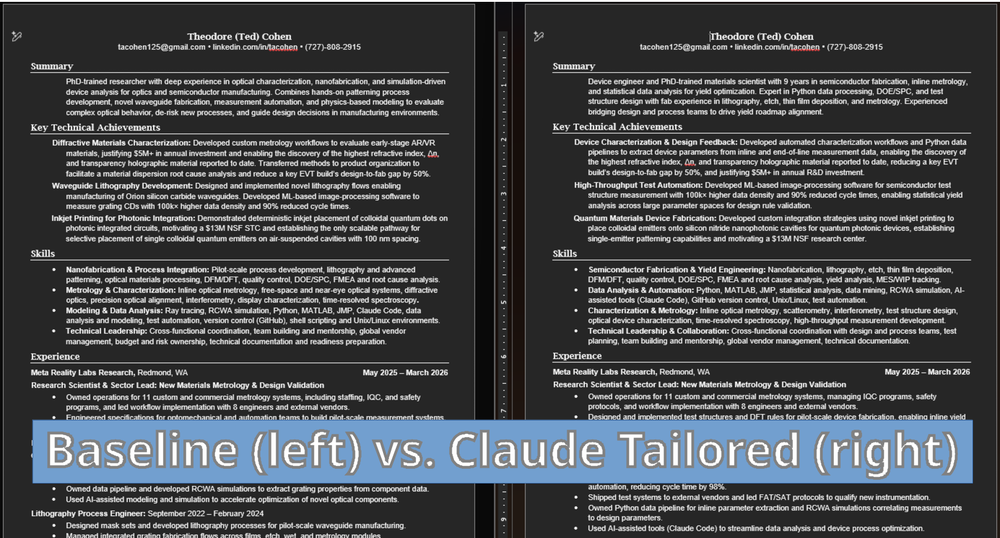

# Job Application Helper

A Claude AI skill for automating and optimizing job application materials using LinkedIn Parsing System (LPS) and Applicant Tracking System (ATS) best practices.

## Overview

This skill provides a comprehensive workflow for creating tailored resumes and cover letters optimized for specific job postings. It works for any professional background — run `onboard.py` with your resume and it configures itself to your experience, sections, and target page count automatically.

### Example Resume Output


### Key Features

- **LPS/ATS Optimization**: Ensures resumes pass automated screening systems with targeted keyword density (60-80% match)
- **XML-Based Resume Editing**: Preserves exact formatting by directly editing .docx XML structure
- **Cover Letter Generation**: Creates compelling, company-specific cover letters with web-researched content
- **LinkedIn Profile Optimization**: Comprehensive guidance for optimizing all LinkedIn profile sections
- **LinkedIn Profile Comparison**: Systematic workflow to compare existing profiles against best practices
- **Scope-Based Execution**: Only works on explicitly requested documents (resume, cover letter, or both)
- **Quality Assurance**: Automated page count verification and formatting validation
- **Multi-Step Workflow**: Guided process from job description analysis to final document delivery

## Table of Contents

- [⚠️ Important: Personalization Required](#️-important-personalization-required)
  - [Files You MUST Update](#files-you-must-update)
  - [Quick Start Checklist](#quick-start-checklist)
- [How It Works](#how-it-works)
  - [Step 1: Job Description Analysis](#step-1-job-description-analysis)
  - [Step 2: Resume Tailoring](#step-2-resume-tailoring)
  - [Step 3: Cover Letter Creation](#step-3-cover-letter-creation)
  - [Step 4: Quality Assurance](#step-4-quality-assurance)
  - [Step 5: Delivery](#step-5-delivery)
- [Using the Skill](#using-the-skill)
  - [With Claude Code (CLI)](#with-claude-code-cli)
  - [With Claude AI (Browser)](#with-claude-ai-browser)
- [Advanced Customization](#advanced-customization)
- [Additional Capabilities](#additional-capabilities)
- [Technical Details](#technical-details)
  - [LPS/ATS Optimization Strategy](#lpsats-optimization-strategy)
  - [XML Editing Approach](#xml-editing-approach)
- [Dependencies](#dependencies)

## ⚠️ Important: Personalization Required

**This skill must be configured with your resume and background before use.** Run the onboarding script — it handles everything automatically.

### Quick Setup

```bash
cd skills/job-application-helper
python scripts/onboard.py --resume /path/to/your_resume.docx
```

The onboarding script:
1. Parses your resume — detects your name, contact info, work history, and skills
2. Copies your resume to `assets/` under `FirstName_LastName-RESUME.docx`
3. Writes `config.sh` so all scripts know your filename and target page count
4. Scaffolds `references/user_profile.md` pre-populated with your actual experience bullets
5. Scaffolds `references/list_of_key_accomplishments.md` from your resume's accomplishments section
6. Creates `references/list_of_target_companies.md` as a blank template
7. Calibrates char count targets for your specific document

### After Onboarding — What to Fill In

| File | What needs your attention |
|------|--------------------------|
| `references/user_profile.md` | Verify contact info, polish professional summary, add target roles |
| `references/list_of_key_accomplishments.md` | Add metrics to any pre-populated entries that lack them |
| `references/list_of_target_companies.md` | Add your target companies and roles |

### Cover Letter Setup

See `templates/cover_letter_setup.md` for options:
- **Option A**: Ask the skill to draft your first cover letter from your `user_profile.md`
- **Option B**: Bring your own `.docx` cover letter and add it with `--cover-letter /path/to/cl.docx`

### Quick Start Checklist

Before using this skill for the first time:

- [ ] Run `python scripts/onboard.py --resume /path/to/your_resume.docx`
- [ ] Fill in `references/user_profile.md` — verify contact info, polish summary, add target roles
- [ ] Complete `references/list_of_key_accomplishments.md` — add metrics to pre-populated entries
- [ ] Add companies to `references/list_of_target_companies.md`
- [ ] (Optional) Add a cover letter: re-run `onboard.py --cover-letter /path/to/cl.docx`

## How It Works

The skill follows a structured workflow that adapts based on your request:

### Scope Determination

**The skill only works on what you explicitly request:**
- Resume only
- Cover letter only
- Both resume and cover letter
- LinkedIn profile optimization
- LinkedIn profile comparison (against best practice reference)
- Company research, interview prep, skill gap analysis, or networking support

This ensures you get exactly what you need without unnecessary work.

### Step 1: Job Description Analysis

When you provide a job posting URL or text, the skill:
- Extracts must-have vs. preferred qualifications
- Identifies keyword clusters (technical skills, tools, domain expertise, soft skills)
- Maps job requirements to your experience
- Highlights skill gaps and unique differentiators

### Step 2: Resume Tailoring

**Critical Feature: XML-Based Editing**

Unlike tools that recreate documents (causing formatting issues), this skill uses direct XML manipulation to preserve exact Microsoft Word formatting:

```bash
# 1. Copy and unpack baseline resume to XML
bash scripts/prepare_resume.sh [output_filename].docx

# 2. Edit XML directly (document.xml)
# 3. Pack edited XML back to .docx
python3 /path/to/pack.py unpacked/ [output_filename].docx --original baseline_resume.docx
```

The skill modifies:
- **Branding Title**: Bold, role-specific title (e.g., "Research Scientist")
- **Branding Statement**: 3-4 sentence narrative with top keywords from job description
- **Areas of Expertise**: Reordered pipe-separated expertise areas matching job priorities
- **Technical Skills**: Reordered pipe-separated skills matching job requirements
- **Key Accomplishments**: Reordered by relevance, first words bolded, keyword-optimized
- **Experience**: Bullets reordered and rewritten with parallel language from job posting
- **Education**: Institution name (bold), location, degree (underlined)

**Page Limit**: Maintains strict 2-page maximum through strategic content reduction.

### Step 3: Cover Letter Creation

Generates tailored cover letters with:
- Company research via web search (recent news, products, initiatives)
- STAR method accomplishments matching top requirements
- Cultural fit demonstration
- Specific metrics and outcomes

### Step 4: Quality Assurance

Automated verification:
- Page count validation (must be exactly 2 pages)
- Keyword density check (60-80% target)
- ATS compatibility verification
- Formatting consistency

### Step 5: Delivery

Files are delivered with standardized naming:
- `Cohen-RESUME-[CompanyName]-[RoleTitle].docx`
- `Cohen-COVERLETTER-[CompanyName]-[RoleTitle].docx`

## Using the Skill

### With Claude Code (CLI)

If you have Claude Code installed:

1. Copy the skill folder to your skills directory:
   ```bash
   cp -r skills/job-application-helper ~/.claude/skills/
   ```

2. Use the skill in conversation:

   **For resume/cover letter:**
   ```
   /job-application-helper

   I'm applying to [Company] for [Role]. Here's the job description:
   [paste job description]

   I need: [resume only / cover letter only / both]
   ```

   **For LinkedIn profile optimization:**
   ```
   /job-application-helper

   Help me optimize my LinkedIn profile for [target role]
   ```

   **For LinkedIn profile comparison:**
   ```
   /job-application-helper

   Compare my LinkedIn profile against best practices. Here's my profile PDF:
   [attach your LinkedIn profile PDF]
   ```

### With Claude AI (Browser)

To use this skill with Claude.ai through your browser, you need to package it into a `.skill` file:

#### Prerequisites

- Python 3.x installed
- `zipfile` module (included in standard Python)

#### Packaging Instructions

1. **Navigate to the repository root**:
   ```bash
   cd /path/to/technicalAIJobSearch
   ```

2. **Run the packaging script**:
   ```bash
   python utils/package_skill.py skills/job-application-helper
   ```

   This will:
   - Validate the skill structure (check for SKILL.md, proper formatting)
   - Create a `job-application-helper.skill` file in the current directory
   - Display all files being packaged

   Optional: Specify an output directory:
   ```bash
   python utils/package_skill.py skills/job-application-helper ./dist
   ```

3. **Upload to Claude.ai**:
   - Go to [claude.ai](https://claude.ai)
   - Open Settings → Capabilities → Skills
   - Click "+ Add"
   - Click "Upload a skill"
   - Select the local `job-application-helper.skill` file
   - The skill will appear in your skills library

4. **Use the skill**:
   - Start a new conversation or use an existing one
   - Type `/job-application-helper` to activate the skill
   - Paste a job description and let Claude tailor your application materials

#### What package_skill.py Does

The packaging script (`utils/package_skill.py`):

1. **Validates** the skill folder:
   - Checks for required `SKILL.md` file
   - Validates YAML frontmatter (name, description)
   - Ensures skill folder structure is correct

2. **Creates a .skill file**:
   - Bundles the entire skill folder into a zip archive
   - Preserves folder structure and all file paths
   - Uses `.skill` extension (recognized by Claude.ai)

3. **Provides feedback**:
   - Shows validation results
   - Lists all files being packaged
   - Confirms successful creation with output path

Example output:
```
📦 Packaging skill: job-application-helper

🔍 Validating skill...
✅ Skill validation passed

  Added: job-application-helper/SKILL.md
  Added: job-application-helper/assets/Ted_Cohen-RESUME.docx
  Added: job-application-helper/assets/Ted_Cohen-COVERLETTER.md
  [... more files ...]

✅ Successfully packaged skill to: job-application-helper.skill
```

#### Troubleshooting

If packaging fails:

- **Missing SKILL.md**: Ensure `SKILL.md` exists in the skill root folder
- **Invalid YAML**: Check that SKILL.md has valid frontmatter with `name` and `description`
- **Permission errors**: Ensure you have write permissions in the output directory

## Advanced Customization

Beyond the required personalization (see above), you can further customize the skill's behavior:

### Workflow Modifications

1. **Add custom reference files**:
   - Create additional `.md` files in `references/` for domain-specific knowledge
   - Reference them in `SKILL.md` workflow steps
   - Examples: `technical_certifications.md`, `portfolio_projects.md`, `publications.md`

2. **Modify keyword density targets**:
   - Edit `SKILL.md` line 146 to adjust the 60-80% keyword match threshold
   - Lower for more natural language, higher for aggressive ATS optimization

3. **Customize section ordering**:
   - Edit `references/xml_editing_guide.md` to define new section patterns
   - Adjust resume structure based on your industry norms (e.g., Education before Experience for academia)

4. **Modify LinkedIn comparison reference**:
   - Replace `assets/LinkedIn_Best_Profile_Guide.pdf` with your own ideal profile export
   - Update comparison criteria in `references/linkedin_profile_optimization.md`

5. **Add industry-specific templates**:
   - Create alternate baseline resumes for different industries
   - Add conditional logic in `SKILL.md` to select templates based on job posting

### Script Customization

1. **Extend `prepare_resume.sh`**:
   - Add pre-processing steps (e.g., automated backups, version tracking)
   - Integrate with version control for resume iterations

2. **Enhance `verify_page_count.sh`**:
   - Add word count validation
   - Check for common formatting issues
   - Validate keyword density automatically

3. **Create additional utilities**:
   - Job description parser (extract keywords automatically)
   - Cover letter A/B testing tracker
   - Application tracking integration

## Additional Capabilities

Beyond resume and cover letter tailoring, the skill provides:

### LinkedIn Profile Support
- **Profile Optimization**: Comprehensive guidance for all profile sections (headline, about, experience, skills, recommendations)
- **Profile Comparison**: Systematic workflow to compare your LinkedIn profile PDF against best practice reference
  - Structural completeness checking
  - Content quality assessment
  - Resume-to-profile consistency verification
  - Gap analysis with prioritized recommendations
- **Engagement Strategies**: Posts, following, groups, and networking best practices

### Job Search Support
- **Company Research**: Web search integration for recent company news, products, and initiatives
- **Interview Preparation**: STAR method response crafting, format-specific prep (phone, video, onsite)
- **Skill Gap Analysis**: Compare your qualifications against job requirements with actionable recommendations
- **Networking Support**: LinkedIn connection requests, cold email templates, outreach strategies

See the respective files in `references/` for detailed guidance.

## Technical Details

### LPS/ATS Optimization Strategy

Modern hiring systems use two filtering stages:

1. **LinkedIn Parsing System (LPS)**: Screens resumes for keyword density, role-specific language, and structural alignment before human review
2. **Applicant Tracking System (ATS)**: Parses resume content into database fields using section headers and formatting cues

This skill optimizes for both by:
- Placing highest-priority keywords in the first third (branding, summary, accomplishments)
- Using exact phrases from job postings when accurate
- Maintaining parseable structure (no tables, text boxes, or multi-column layouts)
- Using standard section headers
- Quantifying all achievements with specific metrics

### XML Editing Approach

Direct XML editing preserves:
- Exact spacing and indentation
- Font sizes and styles
- Bullet point formatting
- Tab stops and alignment
- Page break positions

The `references/xml_editing_guide.md` contains comprehensive formatting rules, protected XML attributes, and section-specific patterns.

## Dependencies

### System Tools

| Tool | Package | Purpose | Required For |
|------|---------|---------|-------------|
| **LibreOffice** | `libreoffice` | Headless .docx-to-PDF conversion | Page count verification (`verify_page_count.sh`) |
| **pdfinfo** | `poppler-utils` (Linux) / `poppler` (macOS) | Extract page count from PDF | Page count verification (`verify_page_count.sh`) |

**Installation:**
```bash
# Debian/Ubuntu
sudo apt install libreoffice poppler-utils

# macOS
brew install --cask libreoffice && brew install poppler

# Windows - install LibreOffice from https://www.libreoffice.org/download/
# and poppler from https://github.com/ossamamehmood/Poppler-windows/releases
```

### Python Dependencies

| Package | Purpose | Required For |
|---------|---------|-------------|
| **defusedxml** | Safe XML parsing and serialization | pack.py / unpack.py (docx XML processing) |

```bash
pip install defusedxml
```

### Claude Code Dependencies

| Dependency | Purpose | How to Get It |
|-----------|---------|---------------|
| **Anthropic `docx` example skill** | Provides `pack.py` and `unpack.py` for .docx XML editing | Claude.ai: automatically available. Claude Code CLI: install via example skills marketplace, or copy the scripts into `scripts/` locally |
| **Web search capability** | Company research for cover letters | Built into Claude Code and Claude.ai |
| **File system access** | Reading/writing documents | Built into Claude Code and Claude.ai |

**Note:** The scripts search for `pack.py`/`unpack.py` in this order:
1. `scripts/` directory (local — for portability)
2. `/mnt/skills/public/docx/scripts/office/` (Claude.ai browser sandbox)
3. `~/.claude/plugins/marketplaces/anthropic-agent-skills/skills/docx/ooxml/scripts/` (Claude Code marketplace)

---

**[← Back to Main README](../README.md)**
